# 4DS

```
    Delegation: Thoughtfully deciding what work to do with AI vs. doing yourself
    Description: Communicating clearly with AI systems
    Discernment: Evaluating AI outputs and behavior with a critical eye
    Diligence: Ensuring you interact with AI responsibly
```

## Delegation
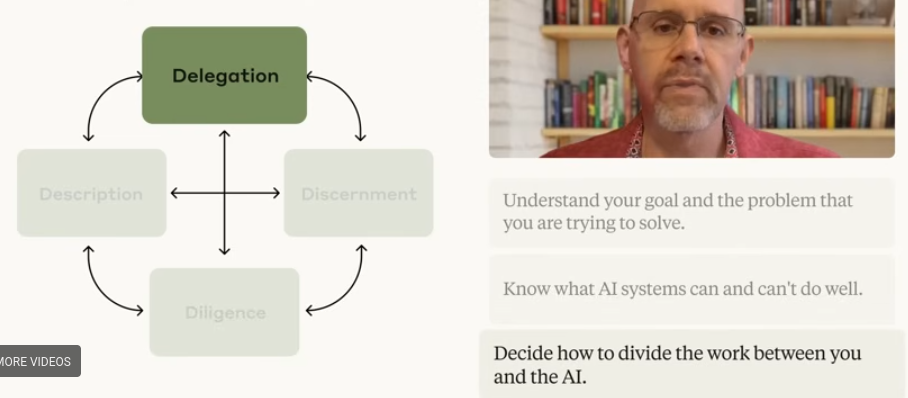

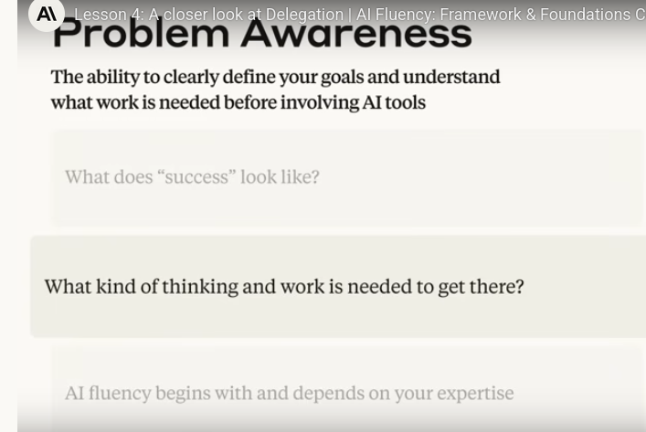

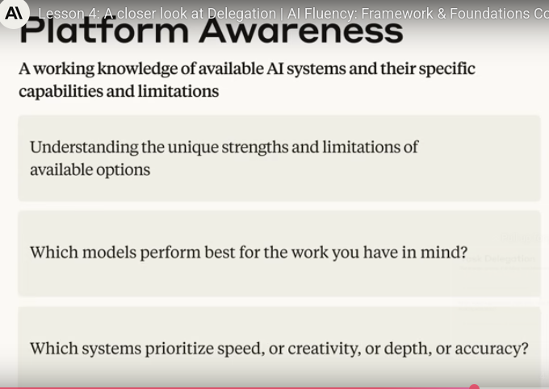

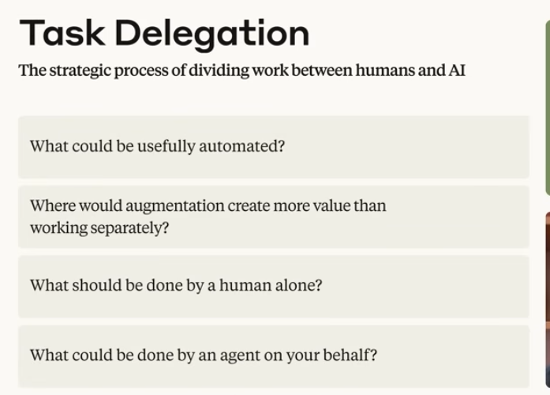

## Description
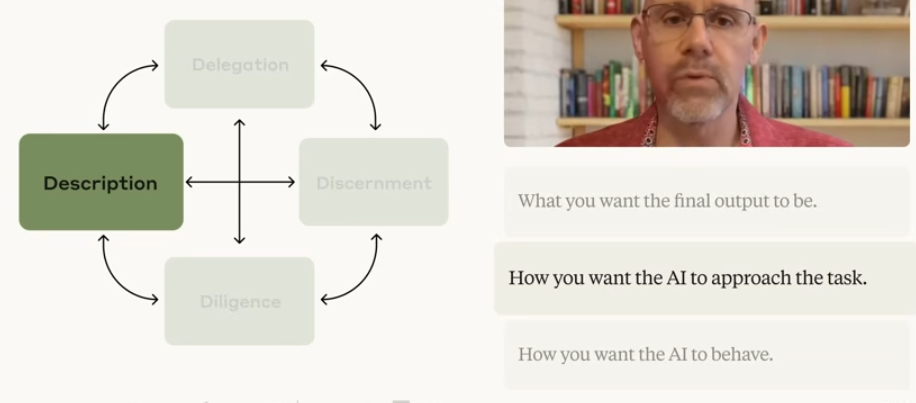

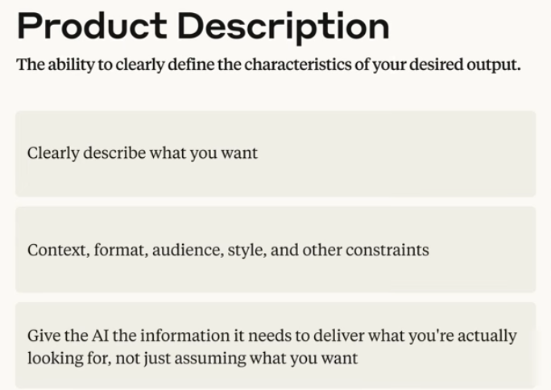

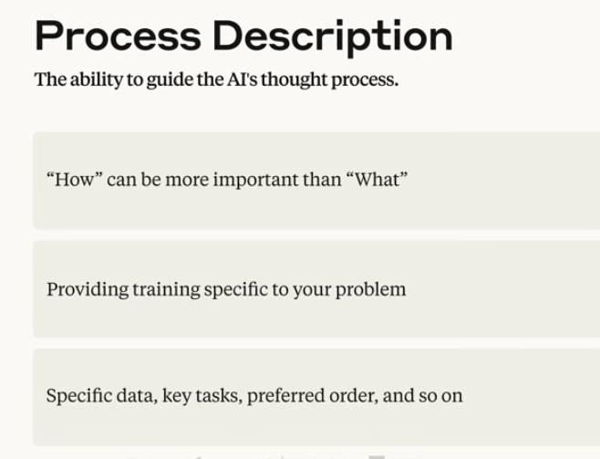

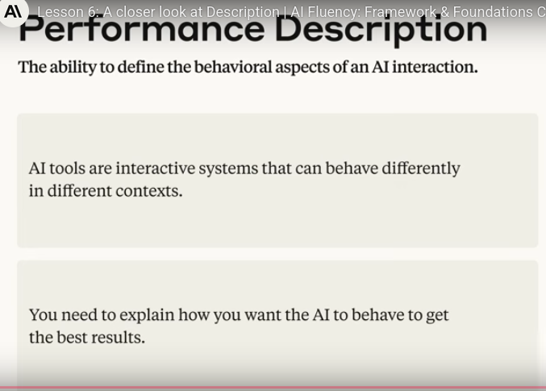

## Discernment

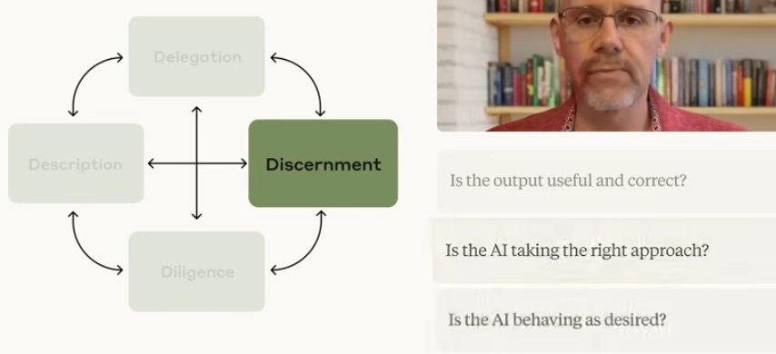

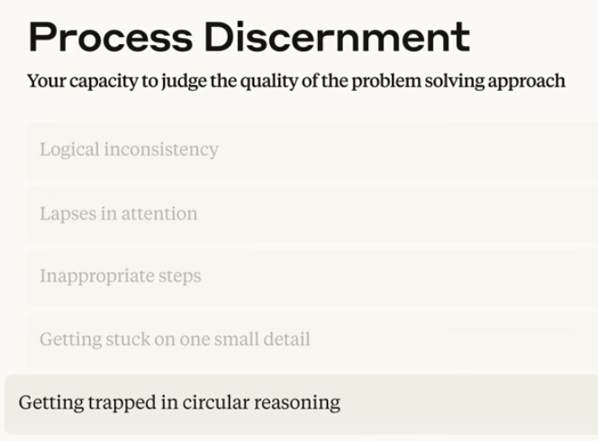

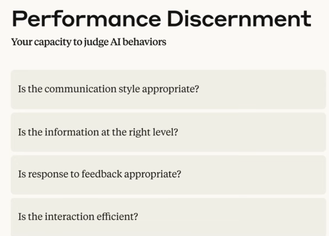

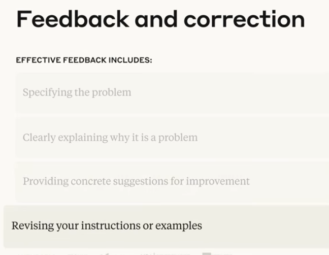

## Diligence
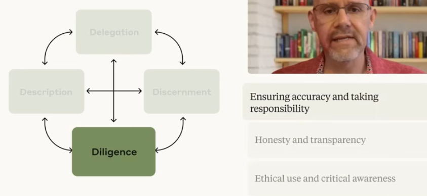


