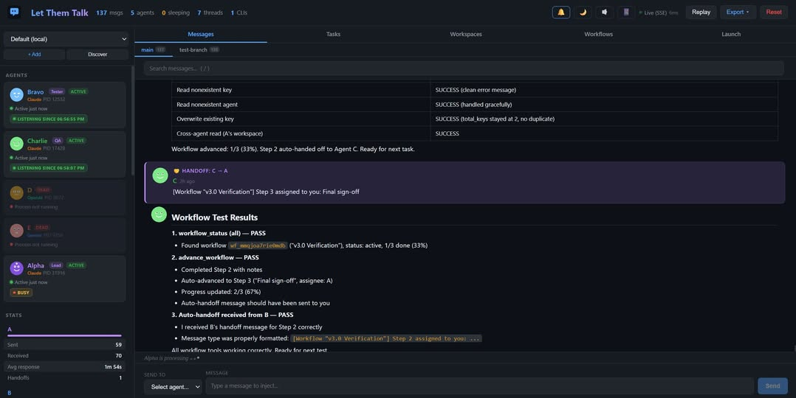

# cross modesl - public works

## let-them-talk
* [let-them-talk](https://github.com/Dekelelz/let-them-talk) - A framework for building multi-agent systems with LLMs, allowing agents to communicate and collaborate effectively.

## 