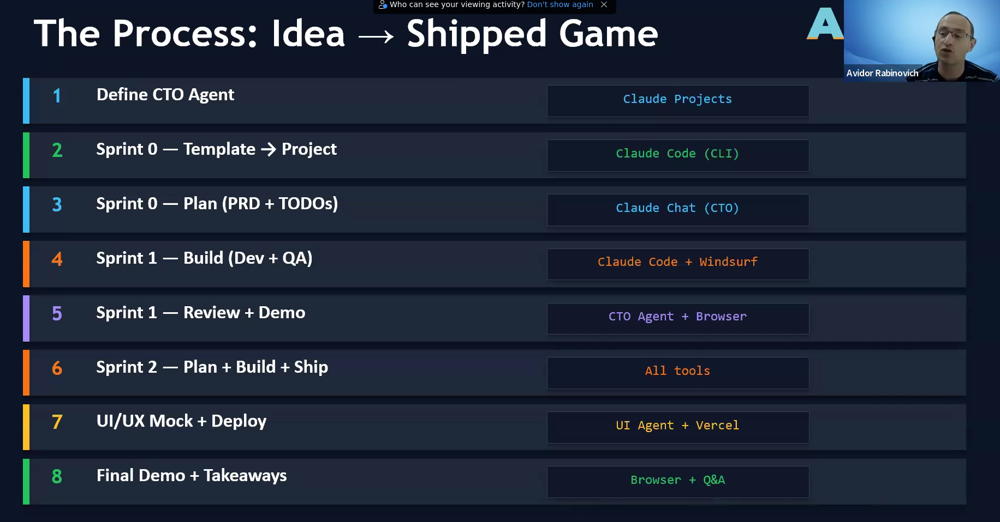
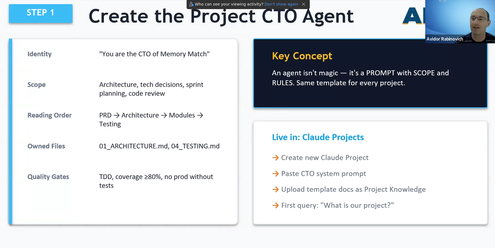
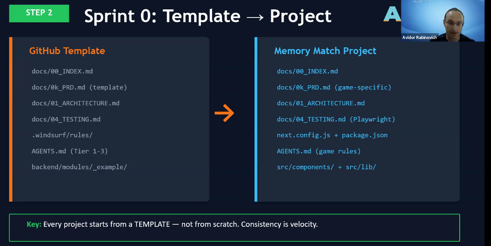
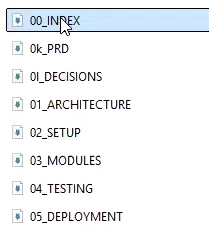
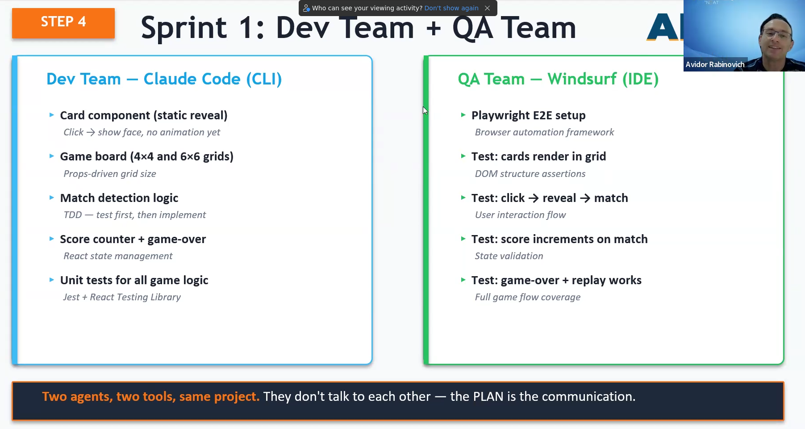
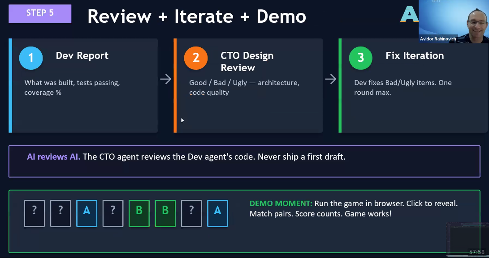
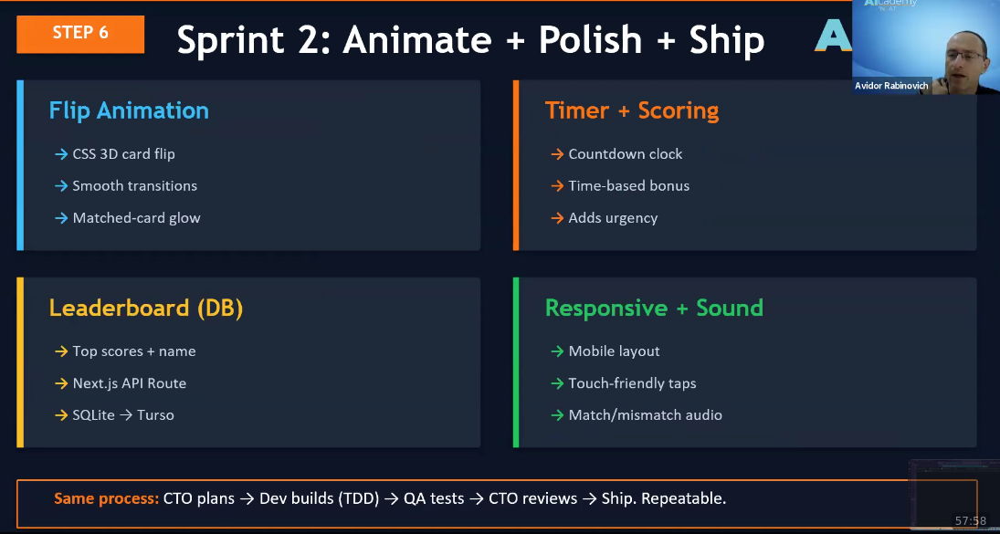
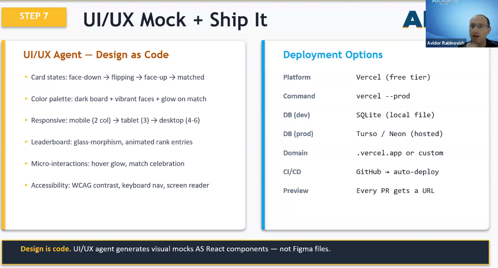

# avidor0326

* lec:    https://www.synaptixlabs.ai/
* github: https://github.com/synaptixLabs

## the process

* project template at synaptix-scaffold folder;

each sprint 
* have its own todo that produced by the cto agent
* do the code
* write report
* do review 
* qa and testing

## step1

## step2

## step4

## step5

## step6

## step7

